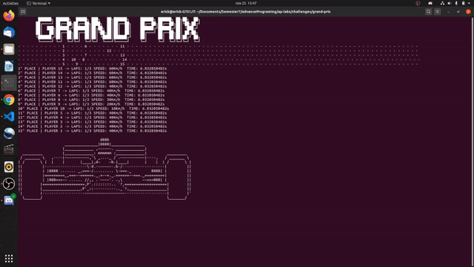
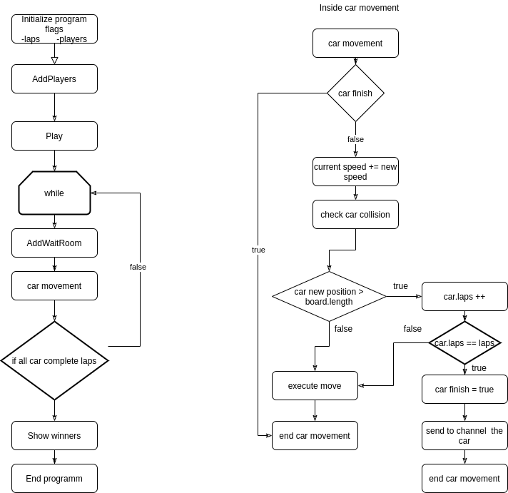
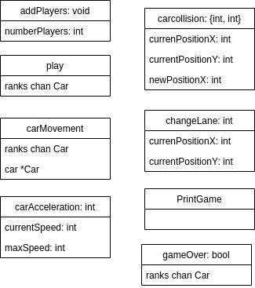

Multithreaded Grand Prix Simulator
==================================

Implement a multithreaded grand prix simulator where every car will be an independent entity.
You  will be simulating an N laps race.


<p >
    
    
</p>

Technical Requirements
----------------------
- The race's lap can be static or automatically generated.
- Racers number can be configured on start.
- Define a random max speed for each car.
- You will emulate the increasing speed behaviour that any car has.
- If a car detect another car on his route and it's slower, it must slow down its speed or try to rebase it.
- Each racer behaviour will be implemented as a separated thread.
- Cars threads must use the same map or city layout data structure resource.
- Define how many laps before starting the race.
- Display each car's speed, position, racing time and lap.
- At the end, display the top 3 winners.


Architecture
-------------

The grand-prix game implemented is shown via terminal where we display all the players with their corresponding speed, time, laps and place in the race.

See our promotional video at https://youtu.be/Kdz1_P6pqrk



The program workflow can be seen in the next diagrams where the one on the left is how does the main thread works.

Basically is a while loop that continues the race until all the players have finished the race and if that is not the case then we synchronized all the go routines that represents all the players movements with a waitroom.



## Structures description

### Car
| Attibutes                  |   DataType   | Description                                                                      |
|----------------------------|--------------|----------------------------------------------------------------------------------|
|     ID                     |     int      | Identifies the player                                                            |
|     positionX              |     int      | The current position of the car in the x axis                                    |
|     positionY              |     int      | The current position of the car in the x axis                                    |
|     maxSpeed               |     int      | Represents the maximum limit that the car can advance in a iteration run         |
|     rank                   |     int      | Saves the actual position of the car, taking the laps and the current position   |
|     laps                   |     int      | The number of laps that the car have completed                                   |
|     raceTime               |     string   | String representation to dislpay time in the UI                                  |
|     finished               |     bool     | Flag to mark if the player already finished the race                             |
|     currentSpeed           |     int      | Represents how many units the car moved in the last iteration                    |
|     currentTime            |     float64  | Saves the current time that car has been in the race only taking the seconds.    |


## Function description



### void addPlayers(numberPlayers int)
* This function is in charge of creating all the cars that are going to participate in the race, with the flag -players <number> you can decide how many players you want to be in the race.
* Inside the functuion we assign the max speed randomly for each player between a range from 70 km/h to 120 km/h
* Assing their initial position depending on how many lanes and the lenght of the array that by default are 5 lanes and 90 units of lenght.
* Add all the players with their respective data to a global array containing all the players.

### void play(ranks chan Car)
* Is the function that will keep the thread carMovement running and non stop untill the the game is over.
* Inside of this loop you will have represented the car movement by calling the go carMovement() goroutine function passing the same parameter of the chanel ranks variable as an indicator of the current positions measure.
* With his respectives wait and sleep  for every iteration (every car turn) will update his route information, since the Car struct has a specific raceTime and currentTime for that.
* To synchronized all the players moves it use a wait room for each go routine initialized and once all the players have done a move we create again go routines for each player.

### void carMovement(car *Car, ranks chan Car)
* Recieving a car struct object representation as a modifiable pointer Responsible of modifying the position of the car parameter, sending the car variable to the ranks channel once it finish the laps, and modifyng the matrix that represents the track so we can see the positions of the players in the terminal in a human readable way.

### int carAcceleration(currentSpeed int, maxSpeed int)
* This function is in charge of simulating the effect of acceleration depending of the maxSpeed and the currentSpeed, it returns the new speed of the car.

### (int, int) carCollision(currentPositionX int, currentPositionY int, newPositionX int)
* This function is in charge of making sure that every car movement avoid any collision with another player and in the case that one car is slower than the current car then their speed slows down or try to change lane and pass the car.

### int changeLane(currentPositionX int, currentPositionY int)
* This function is in charge of cheking in base of the current x and y position if the car can change of lane and if it can it returns the new Lane position else it returns the same position.

### void printGame()
* Printing the matrix we use as the track to make it a lot easier to understand what is happening in the race, simulating the track as joint of "-" and the cars with their respective ID.

### bool gameOver(ranks chan Car)
* Checks all the players laps and if all have finished their respective laps then it return true else it returns false.

### void calculatePositions()
* This function is used to calculate the place of each car
* In case the car has not finished the race then it uses the number of laps of the car and the actual distance to generate the position.
* In case the car already finished, it will use the number of laps and the time difference since it finished and the current time to generate the position.
* Then with the position calculated it prints in order from the first to the last every car in the race.

### int[] removeMultiple(intSlice []int)
* Method for remove equal integer elements inside a slice, recieve the slice with repeated elements and return a free duplicated slice values
```javascript
    //before
    [1 5 3 6 9 9 4 2 3 1 5]
    //after
    [1 5 3 6 9 4 2]
```

### void printBanner()
* This function print the "Grand Prix" banner, we use this for the GUI only for decorative purpouses.

### void printCar()
* This function print the F1 car banner, we use this for the GUI only for decorative purpouses.

### void printPodium(winners []int) 
* This functions receives an array with the first three places of the race and use them to print the final podium with the winners.